```
   _____   __ __  __   __  _____  __  __       _____   __ __  __  __    ____
  / // /  / // / /  |_/ / /  __/ / / / /      / ___/  / // / / / / /   / /| |
 / /_/ / / // / / /|_/ / /__  / / / / /_     / /_/ / / // / / / / /_  / /_/ /
/_____/ /____/ /_/  /_/ /____/ /_/ /___/    /_____/ /____/ /_/ /___/ /_____/
```

> "Saya Rama Taufik Azkia dengan NIM 2508497 mengerjakan Tugas Praktikum 3 dalam mata kuliah Desain dan Pemrograman Berorientasi Objek untuk keberkahanNya maka saya tidak melakukan kecurangan seperti yang telah dispesifikasikan. Aamiin."

*— Janji*

# GARIS BESAR
Bumsil Guild merupakan aplikasi yang mengelola data anggota Serikat Petualang Bumi Siliwangi. *Role*, *stat*, bahkan kemampuan (*skill*) tiap anggota dapat dilihat lewat aplikasi ini. Tersedia dalam 1 interface: CLI (C++, Java, Python).

# DIAGRAM UML
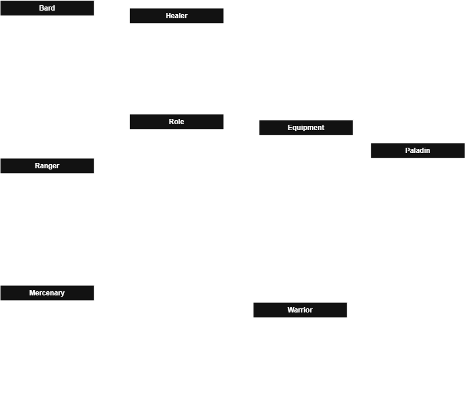

Dalam program ini, terdapat 8 kelas, dengan dua kelas utama: 
  1. `Role`, *super-class* yang menjadi *parent* tiap kelas *role* lainnya. Tiap anggota nantinya akan di-instantiasi dari anak-anak kelas ini. Kelas ini mencakup atribut yang pastinya dimiliki tiap *role*:
      - `ID`, kode unik khusus yang menjadi pembeda utama antar anggota;
      - Nama (`name`), untuk nama anggota;
      - `health`, menandakan ketangguhan tiap anggota;
      - *Stat* dasar (`base_stat`), terdiri dari `STR` (*strength*, kekuatan fisik), `DEF` (*defence*, kekuatan bertahan), dan `MGC` (*magic*, kekuatan sihir);
      - Perlengakapan (`equipments`), yaitu perlengkapan apa saja yang dimiliki tiap anggota.
  Selain itu, kelas ini juga memiliki metode `getFin_()` untuk mendapat nilai akhir tiap *stat* dasar yang sudah dimodifikasi dengan *stat* dari `equipments`;

  2. `Equipment`, yaitu perlengkapan yang bisa digunakan oleh anggota. Tiap perlengkapan memiliki nama dan *stat*-nya tersendiri yang dapat mempengaruhi *stat* dasar penggunanya, baik positif maupun negatif;

Kedua kelas ini memiliki hubungan **agregasi**, dimana tiap anggota **memiliki** `Equipment` mereka masing-masing, namun `Equipment` tetap ada walau sedang tidak ada yang menggunakannya.
Tiap anggota dapat mengambil salah satu dari 6 turunan *role*, terdiri dari *role* dasar dan turunan. *Role* dasar dilengkapi dengan satu *stat* tambahan dan satu *skill* (*cek [CATATAN](#catatan) dibawah*) khusus *role*:
  3. `Warrior`, *role* dasar yang pandai dalam serangan jarak dekat. Dilengkapi dengan *stat* *role* khusus untuk serangan jarak dekat (`melee_str`), juga *skill* serangan jarak dekat (`meleeAtk()`);
  4. `Ranger`, *role* dasar yang pandai dalam serangan jarak jauh. Dilengkapi dengan *stat* *role* khusus untuk serangan jarak jauh (`range_str`), juga *skill* serangan jarak jauh (`rangeAtk()`);
  5. `Healer`, *role* dasar yang pandai dalam penyembuhan. Dilengkapi dengan *stat* *role* khusus untuk kekuatan penyembuhan (`heal_str`), juga *skill* penyembuhan (`castHeal()`);

Dari 3 *role* dasar di atas, terdapat 3 *role* lanjutan yang merupakan kombinasi dari dua *role* dasar. *Role* lanjutan mewarisi *stat* khusus dari kedua *role* asal-nya, namun tidak dapat menggunakan salah satu *skill* dari *role* dasar (*ketika mencoba memanggil metode skill tersebut, selalu me-`return` 0*). *Skill* turunan yang dapat digunakan juga dirombak agar menyesuaikan kondisi *role* lanjutan yang harus menyeimbangkan lebih banyak *stat* *role* khusus ketimbang *role* dasar. *Role* lanjutan juga memiliki tambahan satu *stat* dan satu *skill* khusus:
  6. `Paladin`, gabungan dari `Warrior` dan `Healer`. *Role* ini 'kehilangan' *skill* `castHeal()`, namun mendapat tambahan *skill* pertahanan (`castGuard()`), serta *stat* `STR` khusus bertahan (`guard_str`). `castGuard()` bekerja dengan mengurangi langsung serangan yang diterima;
  7. `Mercenary`, gabungan dari `Ranger` dan `Warrior`. *Role* ini 'kehilangan' *skill* `meleeAtk()`, namun mendapat tambahan *skill* serangan mengendap-endap (`sneakAtk()`), serta *stat* `STR` khusus mengendap-endap (`stealth_str`). `sneakAtk()` menghasilkan kerusakan yang paling tinggi dari semua *skill* serangan yang ada disini;
  6. `Bard`, gabungan dari `Healer` dan `Ranger`. *Role* ini 'kehilangan' *skill* `rangeAtk()`, namun mendapat tambahan *skill* dukungan serangan (`castBuff()`), serta *stat* `STR` khusus dukungan (`buff_str`). `castBuff()` bekerja dengan menambah langsung serangan yang akan ditimbulkan;

Khusus untuk implementasi Java yang tidak mendukung *multiple inheritance*, ada tambahan 3 *interface* independen (`IWarrior`, `IRanger`, `IHealer`). Selain itu, karena *interface* di Java tidak dapat mengandung atribut, maka atribut dari *role interface* yang di-implementasi-kan pada *role* lanjutan, di-definisi-kan langsung di *role* lanjutan (*misal, role `Bard` diturunkan dari `Ranger` dan meng-implementasi-kan `IHealer`, maka dalam kelas role `Bard`, akan di-definisi-kan ulang untuk atribut role `Healer`*). 3 *interface* independen ini dibuat sehubungan anggota juga tetap dapat mengambil *role*-*role* dasar (*interface* tidak bisa di-instantiasi) sehingga 3 *role* dasar harus tetap dibuat kelasnya masing-masing. Ditambah, karena *interface* tidak bisa diwarisi dari kelas yang dimana kelas `Role` memiliki atribut yang cukup banyak, maka dari itu saya mengambil keputusan untuk mewarisi kelas `Role` kepada 3 kelas *role* dasar dan membuat 3 *interface* independen, ketimbang membuat kelas `Role` menjadi *interface* lalu mengimplementasikan kelas *role* dasar lewat *interface* yang diwarisi dari *interface* `Role`.

# FITUR
1. Tambah data baru;
2. Lihat data;
3. Ubah data berdasarkan SKU;
4. Hapus data berdasarkan SKU;
5. Penyimpanan data berbasis `session` di implementasi *web*;
6. Pencarian data berdasarkan 'SKU' dan 'Nama' produk.

# ALUR
Saat pertama kali membuka aplikasi, pengguna akan disambut menu (CLI)/*homepage* (*Web*), seperti berikut:

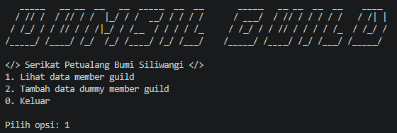

Pada awalnya, tidak ada data yang tersedia. Untuk saat ini, program belum bisa menambahkan data lewat input pengguna, namun opsi 2 akan menambahkan 6 data anggota statis, 1 untuk masing-masing *role*.

# ERROR HANDLING
*Error handling* dibawah berlaku untuk semua implementasi. Saat terjadi *error*, program akan mengembalikan pesan dan meminta ulang *input* yang sesuai.
  1. Mencoba input opsi yang tidak sesuai:
  
  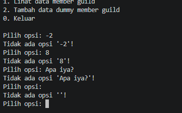

# DOKUMENTASI
1. Java

| Keadaan | *screenshot* |
| --- | --- |
| Sebelum ada data | 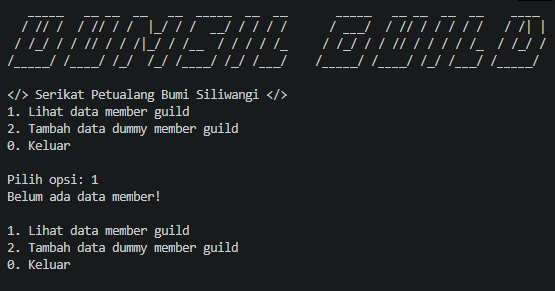 |
| Menambah data | 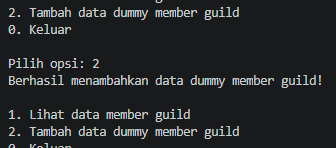 |
| Sesudah ada data | 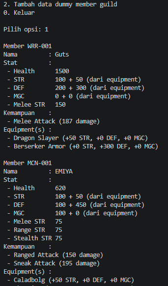 |
2. C++

| Keadaan | *screenshot* |
| --- | --- |
| Sebelum ada data | 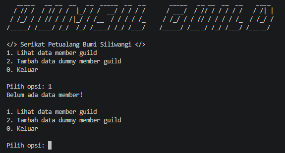 |
| Menambah data | 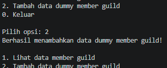 |
| Sesudah ada data | 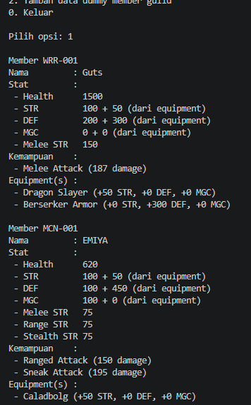 |
3. Python

| Keadaan | *screenshot* |
| --- | --- |
| Sebelum ada data | 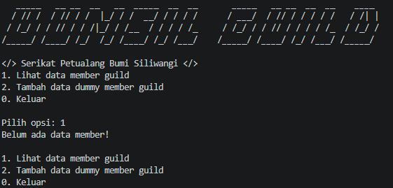 |
| Menambah data | 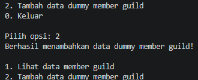 |
| Sesudah ada data | 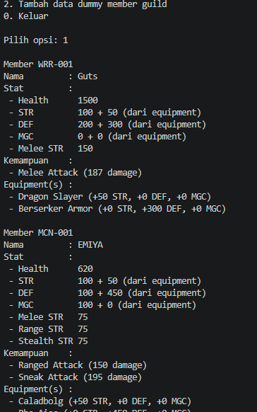 |

# CATATAN
Aplikasi ini murni hanya untuk mengelola data anggota. Metode *skill* disini belum benar-benar di-implementasi-kan agar dapat mengurangi atau menyembuhkan `health`, namun hanya mengembalikan kalkulasi nilai dari *skill* tersebut (*misal, seberapa besar serangan yang akan ditimbulkan, seberapa besar serangan lawan yang dimitigasi*) .

